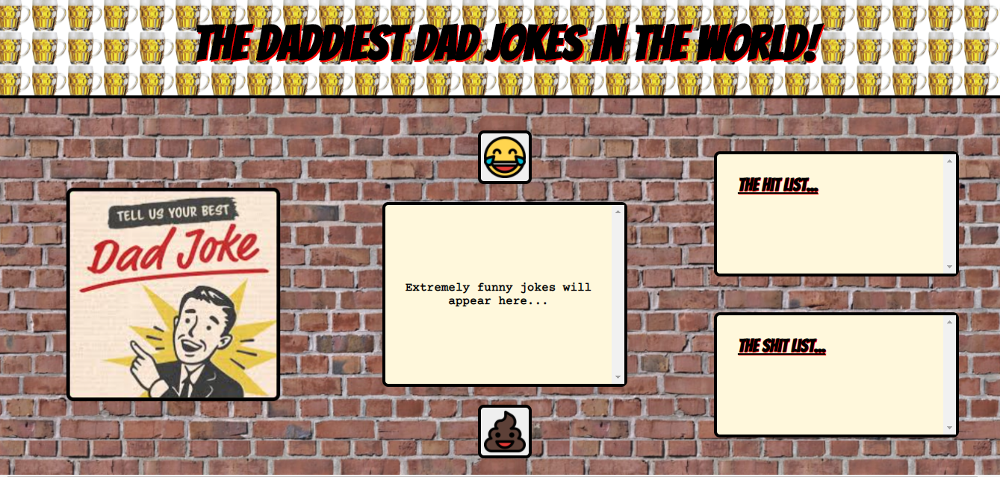

# Dad Jokes Generator

#### School of Code Bootcamp - Hackathon Week 2

###### October 2020

_Our Week 2 hackathon was to make an app that requested data from a server using `fetch()`. We decided to make a Dad Jokes Generator which used a dad jokes API. When you click the button on the left a joke appears in the middle. You can then choose to add the joke to the hit list or the sh\*\*t list by pressing either the laughing face emoji or the poo emoji!_

### Main Learning Points:

- Using `fetch()` to get data from an API
- Reading API docs and understanding how to use them
- We broke the problem down until it was small enough for us to be able to translate it into code
- We used all of the knowledge we had learned over the first two weeks of the bootcamp to make our joke generator which included variables, types, scope, functions, helper functions, objects, arrays, array methods, the DOM, asynchronous programming, async, await, `fetch()`, CSS and sematic HTML.
- We tried to make it unbreakable by only allowing certain buttons to be pressed at certain times, and only allowing jokes to be added to the lists once. This required some more tricky programming but we got there (and without help!). We were both super pleased with the outcome.
